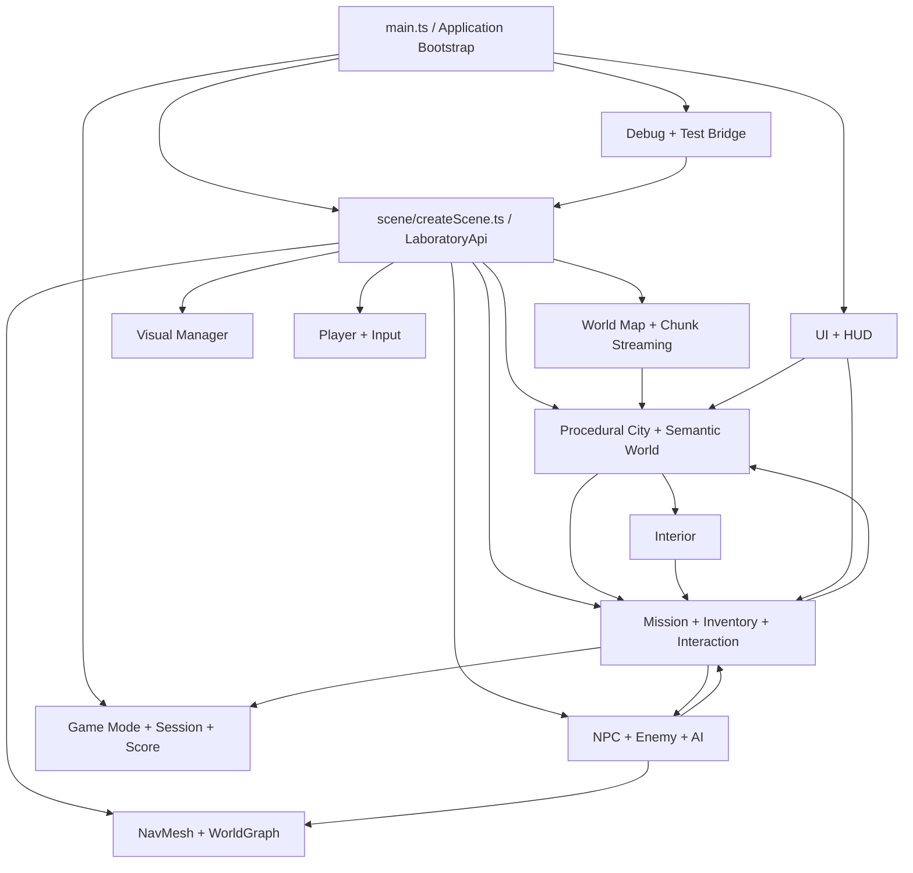
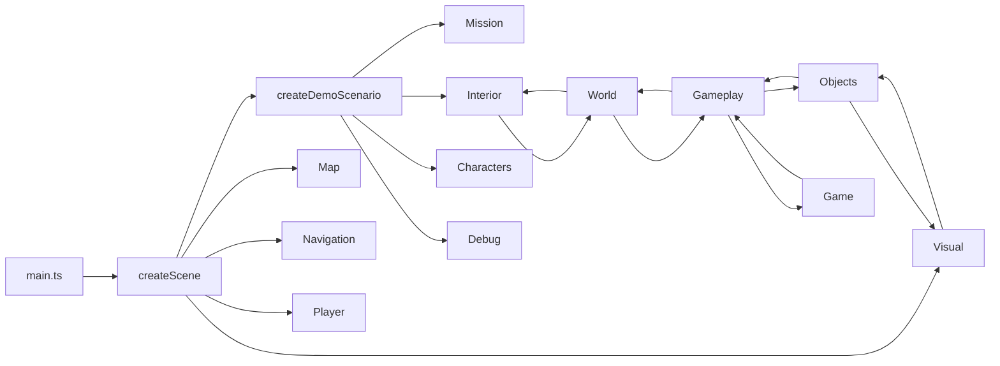
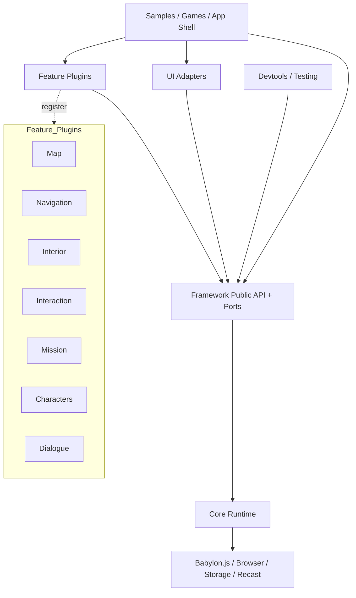

# Framework 1.3.0 Architecture Audit

> This document is the pre-migration baseline. Phase 1 implementation results and updated dependency metrics are recorded in [`ARCHITECTURE_MIGRATION_1_3.md`](./ARCHITECTURE_MIGRATION_1_3.md).

## 0. 監査の前提

- 対象: 現在の `src/` 配下 76 TypeScript ファイル（型宣言ファイルを除く）
- 現行バージョン: **Framework 1.2.1**
- 現行マップ形式: **Map Format 1**
- 本書は調査・提案のみを扱う。コード、公開 API、ファイル配置、バージョン、Map Format は変更していない。
- 分類件数は、密接に関連するファイルをまとめた **41 個の論理モジュール（本書の分類表の行）**を母数とする。
- 「循環依存」は静的 TypeScript import graph の Strongly Connected Component を指す。責務上の双方向依存は別途「循環予備軍」として扱う。

## 1. Current Architecture

現在の実装は、Babylon.js の Scene を中心に、次の機能が一つのアプリケーションとして組み上げられている。



### 1.1 現状の特徴

1. `main.ts` が UI、ゲーム生成、Scene の再生成、GameSession、テスト公開、設定状態を統括する composition root になっている。
2. `scene/createScene.ts` が Scene 構築だけでなく、Player、City、Mission、Character、Map、Navigation、Debug 用 API を一括生成し、巨大な `LaboratoryApi` を公開している。
3. `WorldRegistry` と `SemanticTypes` は、座標だけに依存しない World Semantic の中心として機能している。
4. `WorldMapData` は Mission、Player、Enemy などのランタイム状態を保存せず、マップ構造と Semantic に限定されている。これは維持すべき境界である。
5. Mission、Interior、Interaction、Character は機能しているが、生成処理とサンプルゲーム固有ルールが相互に参照されている。
6. Debug/Test は有用だが、公開ランタイム API と同じ `LaboratoryApi` に結合している。

### 1.2 依存関係の実測概要

フォルダ間 import の多い組み合わせは次の通り。

| From | To | Import edge count | 所見 |
|---|---:|---:|---|
| `world` | `objects` | 13 | World の具象生成として妥当だが、Factory/port で交換可能にしたい |
| `gameplay` | `world` | 12 | Semantic に基づく配置として概ね妥当 |
| `objects` | `utils` | 10 | Material helper 利用 |
| `world` | `gameplay` | 8 | **依存方向が逆**。World が Mission を知っている |
| `interior` | `gameplay` | 6 | **依存方向が逆**。Interior が Mission runtime を知っている |
| `scene` | `gameplay` | 6 | Scene host がサンプル Mission を常設している |
| `world` | `utils` | 6 | 問題は小さい |
| `gameplay` | `objects` | 5 | Mission の具象表現生成 |
| `ui` | `gameplay` | 5 | UI adapter として許容。ただし interface 化が必要 |
| `world` | `random` | 5 | Seeded generation として妥当 |

## 2. Module Classification

分類基準:

- **A CORE**: 最小ランタイム、基本 Scene、抽象 World、基本 Player/Input に必要
- **B OPTIONAL FEATURE**: 無効化・遅延ロードできる独立機能
- **C DEV TOOL**: 開発、検証、自動テスト専用
- **D SAMPLE/GAME**: 実験室デモ、特定ゲームモード、サンプルコンテンツ

> `Move Recommended` は今すぐ移動する指示ではなく、1.3.0 移行時の推奨である。

| # | Module / Files | Classification | Reason | Main Dependencies | Move Recommended | Notes |
|---:|---|---|---|---|---|---|
| 1 | `core/version.ts` | A CORE | 互換性契約 | none | No | Framework/Map version を分離済み |
| 2 | `scene/createScene.ts` | A CORE | Scene host は Core 責務 | Babylon, Player, World, Gameplay, Game, Debug | Yes | 現状は Core と Demo composition が混在 |
| 3 | `player/createPlayer.ts` | A CORE | 基本プレイヤー制御 | Babylon | No | 入力ポートを受け取れると再利用性向上 |
| 4 | `player/mobileControls.ts` | A CORE | 対象端末要件の基本入力 | DOM, Player | No | DOM adapter として分離余地あり |
| 5 | `player/movementSettings.ts` | A CORE | Player 設定契約 | storage | Yes | 保存 adapter を外へ出す候補 |
| 6 | `visual/VisualConfig.ts`, `MaterialLibrary.ts`, `VisualManager.ts` | A CORE | 共通表示品質の基盤 | Babylon, Objects | Yes | Manager→objects の逆参照を除去 |
| 7 | `world/SemanticTypes.ts`, `WorldRegistry.ts` | A CORE | World の意味・検索基盤 | Random | No | game-specific type/tag は拡張名前空間へ |
| 8 | `objects/primitives.ts`, `environment.ts`, `building.ts` | A CORE | コード生成 3D の基礎 | Babylon, Materials, Visual | Yes | Primitive factory と prefab を分離 |
| 9 | `random/seededRandom.ts`, `utils/materials.ts` | A CORE | 決定的生成と共通 helper | Babylon | No | 純粋 utility を維持 |
| 10 | `gameplay/EventManager.ts` | A CORE | 疎結合な通知に転用可能 | none | Yes | `core/events` へ。型付き event 化 |
| 11 | `world/cityStyles.ts`, `citySettingsStorage.ts`, `types.ts` | B OPTIONAL FEATURE | City 固有設定 | Random, Mission types | Yes | storage と domain config を分離 |
| 12 | `world/cityGenerator.ts` | B OPTIONAL FEATURE | プロシージャル街生成 | World, Objects, Interior, Gameplay | Yes | Plugin entry point にする |
| 13 | `world/roadGenerator.ts` | B OPTIONAL FEATURE | City road feature | Objects, Registry | Yes | city plugin 配下へ |
| 14 | `world/buildingGenerator.ts` | B OPTIONAL FEATURE | City building feature | Objects, Interior | Yes | Shell 生成と interior hook を分離 |
| 15 | `world/parkGenerator.ts`, `styleObjects.ts` | B OPTIONAL FEATURE | City decoration | Objects, Random | Yes | Decoration budget を config 化 |
| 16 | `furniture/createFurniture.ts` | B OPTIONAL FEATURE | Interior 装飾 | Objects, Random, Interior | Yes | interior plugin 配下へ |
| 17 | `objects/bench.ts`, `tree.ts`, `streetLight.ts` | B OPTIONAL FEATURE | Street prop catalog | Objects, Utils | Yes | visual assets ではなく prefab catalog |
| 18 | `map/WorldMapData.ts`, `MapMigration.ts` | B OPTIONAL FEATURE | 永続 Map schema | Core version, Semantic | No | Game state を入れない現状を維持 |
| 19 | `map/ChunkGenerator.ts`, `WorldMapManager.ts` | B OPTIONAL FEATURE | Streaming/expansion | Map, Objects, Registry, DOM | Yes | storage/UI を port に分離 |
| 20 | `navigation/WorldGraph.ts` | B OPTIONAL FEATURE | Area 間の経路 | Registry | No | NavMesh 非依存 fallback として良好 |
| 21 | `navigation/NavigationManager.ts` | B OPTIONAL FEATURE | Recast/NavMesh | Babylon, Recast, Registry, DOM | Yes | Recast と UI status を adapter 化 |
| 22 | `interaction/Interactable.ts`, `InteractionManager.ts` | B OPTIONAL FEATURE | 汎用 interact contract | Babylon | No | feature service として比較的独立 |
| 23 | `objects/interactiveDoor.ts`, `interactiveItem.ts`, `interactiveSwitch.ts`, `goalZone.ts` | B OPTIONAL FEATURE | Interaction の具象部品 | Interaction, Gameplay | Yes | credential/inventory を capability port に |
| 24 | `gameplay/InventoryManager.ts` | B OPTIONAL FEATURE | Inventory feature | callbacks | Yes | gameplay/inventory feature へ |
| 25 | `interior/Room.ts`, `InteriorManager.ts`, `world/buildingInteriorGenerator.ts` | B OPTIONAL FEATURE | Interior feature | World, Interaction, Mission, Objects | Yes | World generator から分離必須 |
| 26 | `gameplay/MissionTypes.ts`, `MissionTemplates.ts`, `MissionGenerator.ts`, `MissionValidator.ts` | B OPTIONAL FEATURE | Mission definition/generation | World, Placement, Random | Yes | templates は sample data と engine に分割 |
| 27 | `gameplay/ObjectiveManager.ts`, `MissionRuntime.ts`, `GamePlacementManager.ts` | B OPTIONAL FEATURE | Mission runtime | World, Interaction | Yes | generic objective engine 化 |
| 28 | `gameplay/MissionGuideManager.ts` | B OPTIONAL FEATURE | Navigation aid | Mission, Navigation, World | Yes | Mission target provider interface を使用 |
| 29 | `characters/Character.ts`, `CharacterFactory.ts`, `CharacterManager.ts`, `CharacterStateMachine.ts` | B OPTIONAL FEATURE | Character framework | World, Navigation, Interaction | Yes | base feature package へ |
| 30 | `characters/NPCCharacter.ts` | B OPTIONAL FEATURE | NPC behavior | Character, Dialogue | Yes | NPC plugin |
| 31 | `characters/EnemyCharacter.ts`, `ai/DetectionSystem.ts`, `ai/CharacterNavigation.ts` | B OPTIONAL FEATURE | Enemy/AI behavior | Character, Navigation, Gameplay | Yes | Detection と game failure を分離 |
| 32 | `dialogue/DialogueManager.ts` | B OPTIONAL FEATURE | Dialogue feature | DOM/callbacks | Yes | UI renderer を adapter 化 |
| 33 | `debug/DebugPanel.ts` | C DEV TOOL | Runtime inspector | `LaboratoryApi`, Mission Guide | Yes | public read-only diagnostics port に依存させる |
| 34 | `debug/DebugTestManager.ts` | C DEV TOOL | 手動検証コマンド | Scene, Mission, Inventory, Navigation | Yes | devtools package |
| 35 | `testing/TestBridge.ts` | C DEV TOOL | Playwright bridge | `LaboratoryApi`, Game, Visual | Yes | production bundle から除外可能にする |
| 36 | `ui/debugReadout.ts` | C DEV TOOL | Debug HUD | `LaboratoryApi`, DOM | Yes | dev UI package |
| 37 | `ui/registerWebMcp.ts` | C DEV TOOL | 自動操作公開 | DOM model context | Yes | dev-only dynamic import |
| 38 | `main.ts` | D SAMPLE/GAME | 現在の実験室アプリ本体 | ほぼ全 subsystem | Yes | `samples/space-lab` の composition root へ |
| 39 | `scene/generators.ts` | D SAMPLE/GAME | 初期実験フィールド | Objects | Yes | sample content |
| 40 | `gameplay/createDemoScenario.ts` | D SAMPLE/GAME | 固有 Mission/Character 構成 | Gameplay, Game, Debug, Interior | Yes | sample scenario plugin |
| 41 | `game/*`, `ui/createControls.ts`, `ui/gameplayUi.ts` | D SAMPLE/GAME | ESCAPE/STEALTH/EXPLORATION と画面 | Game, Gameplay, DOM, World | Yes | reusable UI contracts と sample UI に分割 |

### 2.1 分類集計

| Classification | Count |
|---|---:|
| A CORE | **9** |
| B OPTIONAL FEATURE | **21** |
| C DEV TOOL | **5** |
| D SAMPLE/GAME | **6** |
| Total | **41** |

## 3. Dependency Graph

### 3.1 現在のレイヤー構造

現状は composition root が二重化している。`main.ts` と `createScene.ts` の双方が具象 feature を生成し、`createDemoScenario.ts` が第三の composition root として機能する。



### 3.2 推奨する理想構造

依存方向は外側から内側への一方向にし、Core は feature の存在を知らない。



理想的な機能間接続は direct import ではなく、次のいずれかに限定する。

1. Core が定義する小さな port/interface
2. 型付き event
3. Feature registration と lifecycle hook
4. 読み取り専用 query service

## 4. Problematic Dependencies

問題依存は監査単位として **12 件**。重要度は High / Medium / Low。

| ID | Severity | Dependency | Problem | Recommendation |
|---|---|---|---|---|
| P01 | High | `scene/createScene` → `createDemoScenario`, Game/Debug types | Core Scene がサンプルゲームを常設 | `FrameworkRuntime` と sample composition を分ける |
| P02 | High | `world/buildingInteriorGenerator` → Mission/Inventory/Objective | World 生成がゲーム進行を知る | `InteriorBlueprint` を返し、Mission adapter が配置する |
| P03 | High | `InteriorManager` → `MissionPlan`/`MissionRuntime` | Interior lifecycle と Mission lifecycle が固定結合 | `InteriorContentProvider`、`CredentialPort`、event に置換 |
| P04 | High | `interactiveDoor`/`interactiveItem` → `InventoryManager` | World object が特定 inventory 実装に依存 | `CredentialReader` / `ItemSink` interface を Core 側に置く |
| P05 | Medium | `visual` ↔ `objects` | `VisualManager` は street light を知り、ObjectContext は MaterialLibrary を知る | `LightingRegistry` と `MaterialProvider` で一方向化 |
| P06 | High | `gameplay` ↔ `game` | Demo scenario が GameMode/Discovery を参照し、Game が Mission を参照 | game package を最外層の rule adapter にする |
| P07 | Medium | `WorldMapManager` → DOM | Map service が `#chunk-status` を直接更新 | `MapStatusSink` event/UI adapter を使う |
| P08 | Medium | `NavigationManager` → DOM | Navigation service が loading element を直接更新 | `NavigationStatusChanged` event にする |
| P09 | Medium | Map/Score/Movement settings → `localStorage` | Domain/service と browser persistence が不可分 | `StoragePort` と browser adapter を分ける |
| P10 | Medium | UI → City/Mission concrete types + persistence | 表示、入力解析、保存、domain command が同一層 | ViewModel/commands と settings repository を導入 |
| P11 | Medium | Debug/Test → giant `LaboratoryApi` | 内部変更が全テスト・debug UI に波及 | 安定した `DiagnosticsApi` と `TestControlApi` を公開 |
| P12 | High | `main.ts` が全状態を所有 | 再生成、GameSession、UI、テスト公開が一つの mutable flow | `ApplicationHost` と feature lifecycle registry を導入 |

## 5. Circular Dependencies

### 5.1 実循環

静的 import graph を Tarjan SCC で確認した結果、**循環依存は 0 件**だった。

### 5.2 循環予備軍

実循環ではないが、フォルダ単位では次の 5 組が双方向になっている。

| Pair | Cause | Risk |
|---|---|---|
| `world` ↔ `gameplay` | Semantic 利用と Mission 固有 Interior 生成 | 新しい生成ルール追加で静的循環化しやすい |
| `world` ↔ `interior` | Building site と interior generator の相互参照 | 所有権・dispose 順序が不透明 |
| `objects` ↔ `gameplay` | Interactive prefab と inventory/mission | Object catalog の再利用を阻害 |
| `visual` ↔ `objects` | Material context と street-light control | Visual feature toggle を困難にする |
| `gameplay` ↔ `game` | Mission engine と具体 GameMode rule | Mission 単体利用を阻害 |

対策は interface を追加するだけでは不十分で、interface の**所有レイヤー**を内側に置く必要がある。

## 6. Game-specific Leakage

ゲーム固有漏出は **14 件**。

| ID | Leakage | Location / Example | Target boundary |
|---|---|---|---|
| G01 | `ESCAPE | STEALTH | EXPLORATION` 固定 union | `game/GameTypes.ts` | sample game config |
| G02 | モード別 Mission/Enemy/Objective 分岐 | `GameModeManager.ts` | rule plugin |
| G03 | STEALTH/EXPLORATION 固有終了判定 | `GameSession.ts` | game rule plugin |
| G04 | モード別スコア式 | `ScoreManager.ts` | score strategy |
| G05 | モード・難易度別 NPC/Enemy 数 | `createDemoScenario.ts` | scenario config |
| G06 | Scene が既定 `ESCAPE` と DemoScenario を生成 | `scene/createScene.ts` | sample composition |
| G07 | `ITEM`, `ENEMY_SPAWN`, `NPC_SPAWN`, `GOAL_AREA` | `SemanticTypes.AreaType` | extensible semantic kind |
| G08 | `mission`, `danger`, `safe` 等の game tag | `SemanticTypes.AreaTag` | namespaced/custom tags |
| G09 | `mission_site`, `goal_001`, `door_gate_001` 等 | demo/placement code | scenario-owned IDs |
| G10 | Building interior が MissionPlan を解釈 | `buildingInteriorGenerator.ts` | mission content provider |
| G11 | Interior manager が entrance credential/runtime を所有 | `InteriorManager.ts` | interaction adapter |
| G12 | Door/Item が InventoryManager を直接要求 | `objects/interactive*.ts` | capability interface |
| G13 | UI が Inventory/Mission summary を固定描画 | `ui/gameplayUi.ts` | feature-provided UI extension |
| G14 | LaboratoryApi に mission/debug/game result が常設 | `scene/createScene.ts` | optional API namespaces |

## 7. Feature Toggle Candidates

Feature toggle 候補は **15 件**。compile-time tree-shaking と runtime toggle を区別する。

| Feature key | Default profile | Depends on | Disable behavior |
|---|---|---|---|
| `visual.quality` | all | Core scene | Basic materials/light only |
| `worldMap` | standard+ | World Semantic | Fixed scene remains playable |
| `chunkStreaming` | standard+ | worldMap | Only loaded/base world |
| `navigation` | game+ | World Semantic | WorldGraph/direct fallback |
| `interior` | game+ | Interaction optional | Exterior-only buildings |
| `interaction` | game+ | Player camera | No focus/use actions |
| `inventory` | game+ | Interaction/Event | No item storage |
| `mission` | game+ | Semantic, placement | Free exploration |
| `missionGuide` | game+ | Mission, optional Navigation | Objective text only/off |
| `npc` | simulation/game | Character base | No NPC spawn/update |
| `enemy` | game | Character, Detection, optional Navigation | No hostile actors |
| `dialogue` | game | Interaction/NPC | No dialogue UI |
| `gameModes` | sample-game | Mission/Characters | Framework sandbox only |
| `debugTools` | development | Diagnostics API | No debug bundle/UI |
| `testBridge` | test | TestControl API | No browser-global automation API |

推奨 profile:

| Profile | Enabled |
|---|---|
| `minimal` | Core Scene, Player/Input, World Semantic, base primitives, low visual |
| `world` | minimal + procedural city + worldMap |
| `simulation` | world + navigation + interior + NPC |
| `game` | simulation + interaction + inventory + mission + guide + enemy + dialogue |
| `development` | game + debugTools + testBridge |
| `sample-space-lab` | development + current gameModes/UI/demo scenario |

## 8. Core Minimal Set

1. `FrameworkRuntime`: Engine/Scene の生成、render/resize/dispose。
2. `SceneContext`: Babylon Scene、clock、resource disposer。
3. `WorldRegistry`: framework-neutral な semantic area の登録・検索。
4. `PlayerController` と input ports: Desktop/Touch は adapter。
5. `PrimitiveFactory` と `MaterialProvider`: 最低限のコード生成 Mesh。
6. `VisualRuntime`: 基本 light/material、品質 profile。
7. `TypedEventBus`: feature 間通知。
8. `SeededRandom` と小さな math/material utility。
9. version/map compatibility contracts。

Core minimal set に含めないもの: City、Map streaming、Recast、Interior、Interaction、Inventory、Mission、NPC/Enemy、Dialogue、Game Mode、Debug/Test、特定 UI。

### 8.1 提案 Public API

```ts
export interface FrameworkOptions {
  canvas: HTMLCanvasElement;
  profile?: "minimal" | "world" | "simulation" | "game" | "development";
  features?: Partial<FeatureFlags>;
  adapters?: FrameworkAdapters;
}

export interface FrameworkRuntime {
  readonly scene: Scene;
  readonly world: WorldQuery;
  readonly player: PlayerApi;
  readonly events: FrameworkEventBus;
  readonly features: FeatureRegistry;
  start(): Promise<void>;
  dispose(): void;
}

export interface FrameworkFeature {
  readonly id: string;
  setup(context: FeatureContext): void | Promise<void>;
  start?(): void | Promise<void>;
  stop?(): void;
  dispose(): void;
}
```

`LaboratoryApi` は互換 façade として 1.x 中は残し、内部で新 API に委譲する。Debug command や sample Mission API は `runtime.features.get("...")` または optional namespace に移す。

## 9. State Ownership and Event System

### 9.1 推奨 state owner

| State | Single owner | Readers | Persistence |
|---|---|---|---|
| Engine/Scene lifecycle | `FrameworkRuntime` | all features | none |
| World semantic | `WorldRegistry` | Map, Mission, Navigation, UI | Map serializer only |
| Map/chunks | `WorldMapService` | UI, World | `MapRepository` adapter |
| Player pose/input | `PlayerController` | Guide, AI, UI | optional game save, Map には入れない |
| Navigation | `NavigationService` | Character, Mission validation, Guide | none |
| Interior lifecycle | `InteriorFeature` | Map, Mission | optional map extension |
| Inventory | `InventoryFeature` | Mission, UI, Door credential adapter | Game save repository |
| Mission | `MissionFeature` | Guide, UI, Game rules | Game save repository |
| Character | `CharacterFeature` | AI, UI, Game rules | optional game save |
| Game session/score | sample game/application | UI | game-specific repository |

Map state と game state は分離を維持する。Map Format 1 は地形・chunk・semantic を表し、Mission progress、inventory、door runtime state、player/enemy pose は別の将来 `GameSaveData` に置く。

### 9.2 推奨 event

- `world.generated`, `world.areaRegistered`, `world.areaRemoved`
- `map.chunkLoaded`, `map.chunkUnloaded`, `map.statusChanged`
- `interior.generated`, `interior.disposed`
- `navigation.statusChanged`, `navigation.geometryChanged`
- `interaction.focusChanged`, `interaction.executed`
- `inventory.changed`
- `mission.stepChanged`, `mission.completed`
- `character.stateChanged`
- `visual.dayModeChanged`

イベントは command の代替にしない。状態変更は owner の API を呼び、結果通知のみ event で配信する。

## 10. Independence Assessment

### 10.1 World Semantic

基盤として最も独立性が高い。ただし `AreaType`/`AreaTag` が closed union でゲーム語彙を含む。1.x では既存値を維持しつつ、custom string kind/tag を登録できる API を追加するのが安全。

### 10.2 Visual

設定と MaterialLibrary は独立に近いが、`VisualManager` が street light の具象実装を直接操作している。`EmissiveSourceRegistry`/`LightingParticipant` を介せば Objects を知らずに済む。

### 10.3 Navigation

WorldRegistry 依存は妥当。Recast、debug mesh、DOM loading 表示、geometry discovery が一クラスに集中している。以下に分けるべき。

- `NavigationService` interface
- `WorldGraphNavigation`
- `RecastNavigationAdapter`（dynamic import）
- `NavigationGeometryProvider`
- `NavigationDebugRenderer`

### 10.4 Map/Chunk

Data schema は良好。一方、Manager が generation、Babylon material/mesh、streaming、localStorage、DOM status を所有する。`MapRepository`、`ChunkRenderer`、`ChunkStreamingPolicy` に分ける。

### 10.5 UI / Testing

UI は DOM adapter とし、domain manager を生成・保存しない。TestBridge は production API ではなく、`development` profile の feature として dynamic import する。DebugPanel は Scene の巨大 API ではなく read-only diagnostics snapshots に依存する。

## 11. Bundle and Performance Architecture

現状の主要 bundle 寄与候補:

1. Babylon.js core rendering/material/navigation modules。
2. `recast-detour` と `RecastJSPlugin`。`NavigationManager` の静的 import により、NavMesh を使わない profile にも入りやすい。
3. Mission/Character/Debug/Test/Game UI が Scene の静的 import chain に含まれる。
4. Procedural city/interior/object catalog が初期 bundle に含まれる。

1.3.0 の推奨:

- Recast は `navigation: "navmesh"` のときだけ `import()`。
- Debug/Test/WebMCP は development/test profile だけ `import()`。
- Mission/Character/Interior/Map は feature registration 単位で code split。
- Babylon の既存 path import を維持し、barrel import への逆行を避ける。
- feature 無効時は constructor を呼ばないだけでなく、import chain から除外できる entry point を提供する。

## 12. Recommended Folder Structure

```text
src/
  framework/
    core/
      FrameworkRuntime.ts
      SceneContext.ts
      FeatureRegistry.ts
      TypedEventBus.ts
      version.ts
    api/
      index.ts
      ports.ts
      events.ts
    world/
      SemanticTypes.ts
      WorldRegistry.ts
    player/
      PlayerController.ts
      InputPort.ts
    visual/
      VisualRuntime.ts
      MaterialProvider.ts
    primitives/
      PrimitiveFactory.ts
  features/
    city/
    map/
    navigation/
      adapters/recast/
    interior/
    interaction/
    inventory/
    mission/
    characters/
      npc/
      enemy/
    dialogue/
  adapters/
    browser/
      BrowserStorage.ts
      DesktopInput.ts
      TouchInput.ts
    ui/
  devtools/
    debug/
    testing/
    webmcp/
  samples/
    space-lab/
      main.ts
      scenario/
      game/
      ui/
```

この構造は最終形であり、一括移動は推奨しない。1.x では旧 path から re-export する compatibility façade を維持する。

## 13. Migration Plan

### Phase 0 — Guardrails（1.2.x）

- 現状 import graph、public API、Map Format 1 の contract test を固定。
- `LaboratoryApi` 使用箇所と DOM/localStorage access を一覧化。
- この段階では移動・rename をしない。

### Phase 1 — Ports and Composition（1.3.0-alpha）

- `FrameworkRuntime`、`FeatureRegistry`、typed event、storage/status ports を追加。
- `main.ts` を唯一の composition root にし、`createScene` は Core Scene を返す。
- 旧 `LaboratoryApi` は façade として存続。

### Phase 2 — Dependency Inversion（1.3.0-beta）

- Interior から Mission/Inventory concrete type を除去。
- Interactive objects に capability ports を導入。
- Visual/Objects、Gameplay/Game の双方向参照を一方向化。
- Map/Navigation から DOM/localStorage を除去。

### Phase 3 — Feature Packages and Profiles（1.3.0-rc）

- Optional features を registration 化。
- `minimal/world/simulation/game/development` profile を追加。
- Recast、Debug/Test、sample game を dynamic import。
- 未使用 feature が bundle graph に入らないことを検証。

### Phase 4 — Compatibility and Release（1.3.0）

- 既存起動、PC/mobile、Mission、Map load/save、test bridge の回帰確認。
- deprecated API に移行メッセージを付け、削除はしない。
- Map Format 1 round-trip と古い保存データ読み込みを確認。

### Phase 5 — Breaking Cleanup（将来 2.0）

- deprecated façade/path の削除。
- closed semantic union の breaking redesign が必要なら 2.0 で実施。
- GameSave schema を導入しても Map Format と独立させる。

## 14. Risk Assessment

| Area | Risk | Why | Mitigation |
|---|---|---|---|
| Scene/main composition | High | lifecycle/dispose/rebuild の中心で変更波及が最大 | façade を残し小刻みに委譲 |
| Interior–Mission separation | High | Door、credential、placement、lazy generation が密結合 | contract test と adapter を先に追加 |
| Semantic extensibility | High | Mission/AI/Map/Guide が type/tag を共有 | 既存 union 値を削除せず extension API を追加 |
| Map/Chunk split | High | streaming、Mesh、Registry、storage、UI が同一 Manager | data contract を固定して外側から分離 |
| Navigation/Recast lifecycle | High | async/WASM/iOS fallback/geometry rebuild | adapter 化、timeout/fallback contract を維持 |
| Character/AI extraction | Medium | Mission failure・Dialogue・Navigation と接続 | Character events と policy injection |
| UI separation | Medium | DOM ID に強く依存 | ViewModel を挟み画面単位で移行 |
| Dynamic import | Medium | 起動順序と型の不整合 | profile ごとの integration test |
| Folder moves | Medium | 相対 import と test path が大量 | re-export façade、機械的移動は後半のみ |
| Map Format | Low | 現状の提案は runtime architecture の変更 | schema fields を変更しない |

## 15. Version Recommendation

### Recommendation

**Framework 1.3.0 として実施可能**。条件は次の通り。

- 既存 `LaboratoryApi`、主要 class 名、現行 entry point を compatibility façade で維持する。
- feature の抽出は additive に行い、1.3.0 で既存 API を削除しない。
- Map Format 1 の field と意味を変更しない。
- semantic extension は既存 type/tag を保持した追加 API として導入する。

公開 API rename/removal、既存 constructor の全面変更、保存済み Map の読み替え必須化を同時に行う場合は **2.0.0** が妥当である。

### Breaking change / Map impact

- 1.3.0 提案のままなら breaking change: **不要**
- Map Format change: **不要**
- Game runtime state の永続化は、Map Format を上げず別 `GameSaveData` version を持つべき。

## 16. Final Audit Summary

| Metric | Result |
|---|---|
| FRAMEWORK VERSION | **1.2.1** |
| MAP FORMAT VERSION | **1** |
| CORE MODULE COUNT | **9** |
| OPTIONAL FEATURE COUNT | **21** |
| DEV TOOL COUNT | **5** |
| SAMPLE GAME COUNT | **6** |
| PROBLEMATIC DEPENDENCY COUNT | **12** |
| CIRCULAR DEPENDENCY COUNT | **0** |
| GAME SPECIFIC LEAK COUNT | **14** |
| FEATURE TOGGLE CANDIDATE COUNT | **15** |
| 1.x MIGRATION POSSIBLE | **YES** |
| MAP FORMAT CHANGE REQUIRED | **NO** |
| HIGH RISK AREAS | **Scene/main composition; Interior–Mission separation; Semantic extensibility; Map/Chunk split; Navigation/Recast lifecycle** |

### Top 5 priorities before 1.3.0

1. `FrameworkRuntime`/`FeatureRegistry` を追加し、`main.ts`・`createScene.ts`・`createDemoScenario.ts` の三重 composition を解消する。
2. Interior/World/Object から Mission、Inventory、Game の concrete dependencies を capability ports へ反転する。
3. `LaboratoryApi` を互換 façade にし、Core API、Diagnostics API、Test Control API を分離する。
4. Map/Navigation の DOM・localStorage・Recast を adapter 化し、fallback contract を保持したまま optional/dynamic-load にする。
5. Profile と feature toggle を導入し、Debug/Test/Sample Game を production の最小 bundle から除外できるようにする。

---

この監査では実装変更、リファクタリング、ファイル移動、version 更新、Map Format 更新を行っていない。
